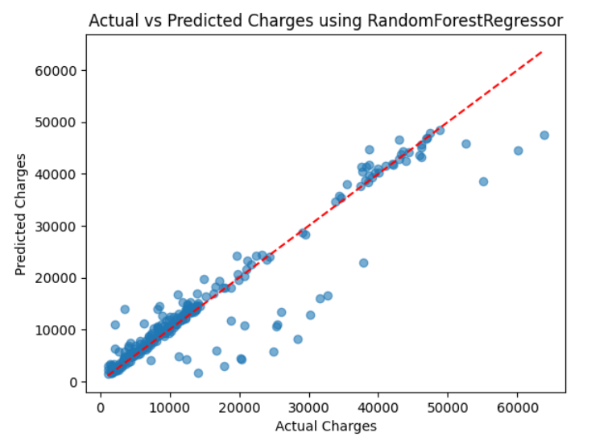

# 💰 Medical Insurance Price Predictor

This project builds a machine learning regression model to predict a person's medical insurance charges based on factors like age, gender, BMI, smoking status, and region.

---

## 📊 Dataset

- **Source**: [Medical Cost Personal Dataset - Kaggle](https://www.kaggle.com/datasets/mirichoi0218/insurance)
- **Features**:
  - Age
  - Sex
  - BMI
  - Number of Children
  - Smoker (Yes/No)
  - Region
  - Charges (Target)

Dataset is not uploaded due to size.  
You can download it manually from Kaggle.

---

## 🔧 Workflow Overview

- Handled duplicates and missing values
- Label encoded categorical features
- Scaled numerical features using `StandardScaler`
- Applied log transformation to handle skewed target
- Trained a `RandomForestRegressor`
- Evaluated using MAE, RMSE, and R² Score
- Visualized actual vs predicted charges

---

## 🧠 Model

- **Algorithm**: Random Forest Regressor
- **Why?** Performs well on non-linear relationships without much tuning
- **Evaluation Metrics**:
  - MAE: `2118.36`
  - RMSE: `4411.39`
  - R² Score: `0.8941`

---

## 📁 Project Structure
medical-insurance-price-predictor/
├── README.md
├── notebook/
│ └── medical_insurance_price_prediction.ipynb
├── data/
│ └── README.md
├── results/
│ ├── actual_vs_predicted.png
│ └── evaluation.txt

## 📈 Results Visualization

> 🔍 Predicted vs Actual Charges  

